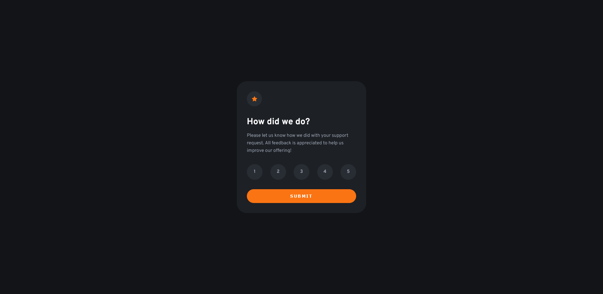

# Interactive rating  

This is a solution to the [Interactive rating component challenge on Frontend Mentor](https://www.frontendmentor.io/challenges/interactive-rating-component-koxpeBUmI). Frontend Mentor challenges help you improve your coding skills by building realistic projects. 

## Table of contents 📋

- [Overview](#overview)
  - [The challenge](#the-challenge)
  - [Screenshot](#screenshot)
  - [Links](#links)
- [Built with](#built-with)
- [Author](#author)

## Overview 🚀

### The challenge

Users should be able to:

- View the optimal layout for the app depending on their device's screen size
- See hover states for all interactive elements on the page
- Select and submit a number rating
- See the "Thank you" card state after submitting a rating

### Screenshot

### Links

- Solution URL: [Add solution URL here](https://your-solution-url.com)
- Live Site URL: [Add live site URL here](https://your-live-site-url.com)

## Built with 🛠️

- [Visual Studio Code](https://code.visualstudio.com/) - Editor
- [ViteJS](https://vitejs.dev/) - JS tooling
- [React](https://reactjs.org/) - JS library
- [CSS](https://developer.mozilla.org/es/docs/Web/CSS) - For styles
- [Flexbox](https://css-tricks.com/snippets/css/a-guide-to-flexbox/) - For layout

## Author ✒️

- Website - [Juan Ceballos](https://jceballos.com.co)
- Frontend Mentor - [@jceballos29](https://www.frontendmentor.io/profile/jceballos29)
- GitHub - [@jceballos29](https://github.com/jceballos29)
- LinkedIn - [Juan Ceballos](https://www.linkedin.com/in/jceballos29/)

## License 📄

This project is licensed under the MIT License - see the [LICENSE](./LICENSE) file for details
